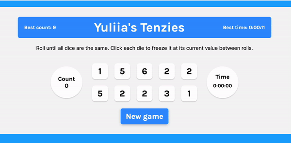

<h1 align="center">Tenzies Game</h1>
 

 
&nbsp;&nbsp;&nbsp;&nbsp;&nbsp;&nbsp;Project Link: <a target="new" href="https://yuliia-kruta.github.io/tenzies-game/">Live Demo</a>
    
 
<h2>Project description</h2>
Tenzies is a fun and addictive dice game built with <b>React</b>. The goal is to roll ten dice until they all show the same number. Players can hold dice to keep their current values between rolls, striving to achieve the best time and fewest rolls.

<h2>Features</h2>
<ul>
  <li>Roll dice to match all ten to the same number.</li>
  <li>Hold dice to keep their values between rolls.</li>
  <li>Track your best time and best roll count.</li>
  <li>Confetti animation when you win the game.</li>
</ul>

<h2>Technologies Used</h2>

<h2>Getting Started</h2>
To get a local copy up and running, follow these simple steps.

<h3>Prerequisites</h3>
Make sure you have npm installed. You can get it by installing Node.js.

<h3>Installation</h3>
<h5>Clone the repository:</h5>
https://github.com/Yuliia-Kruta/tenzies-game.git

<h5>Navigate to the project directory:</h5>
cd tenzies-game

<h5>Install the dependencies:</h5>
npm install

<h5>Start the development server:</h5>
npm start
  
The app will be available at http://localhost:3000.

<h2>How to Play</h2>
- Click the "New game" button to start. 
- Click the "Roll" button to roll the dice. 
- Click on a die to hold its value. 
- Continue rolling until all dice show the same number. 
- Enjoy the confetti when you win!

<h2>License</h2>
Distributed under the MIT License. See LICENSE for more information.

